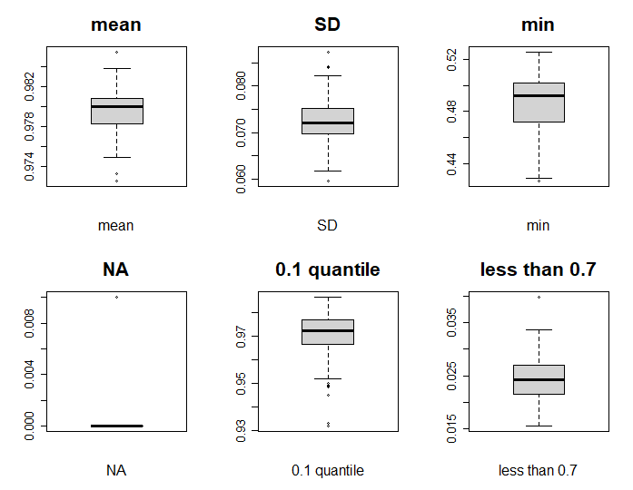
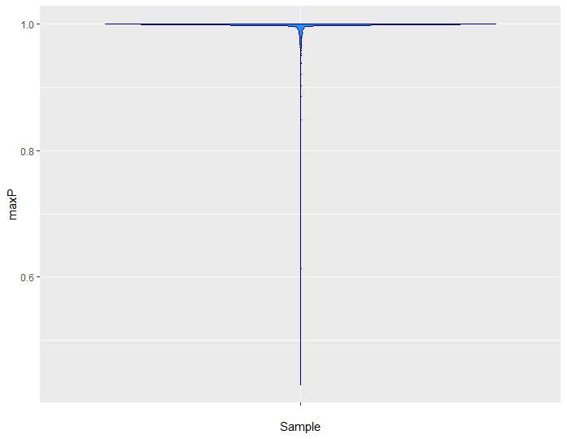
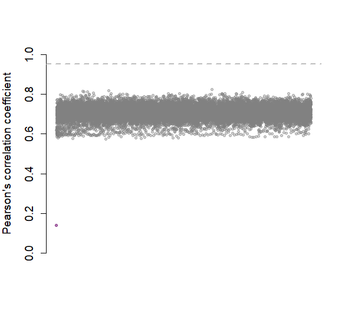
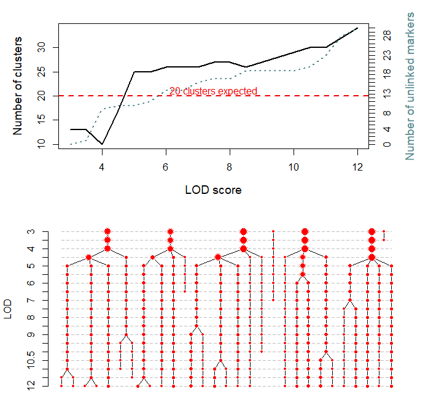
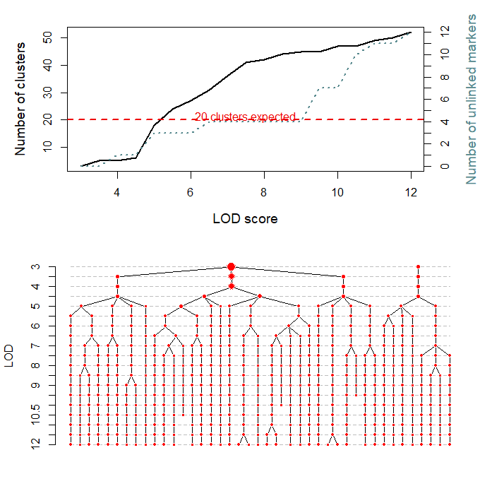
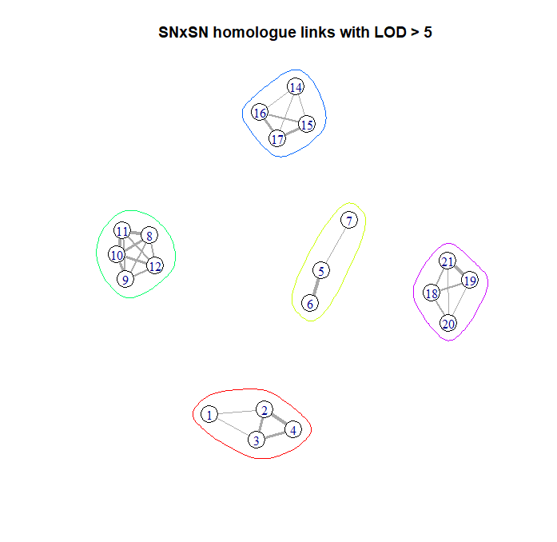
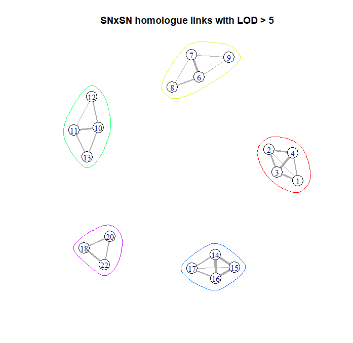
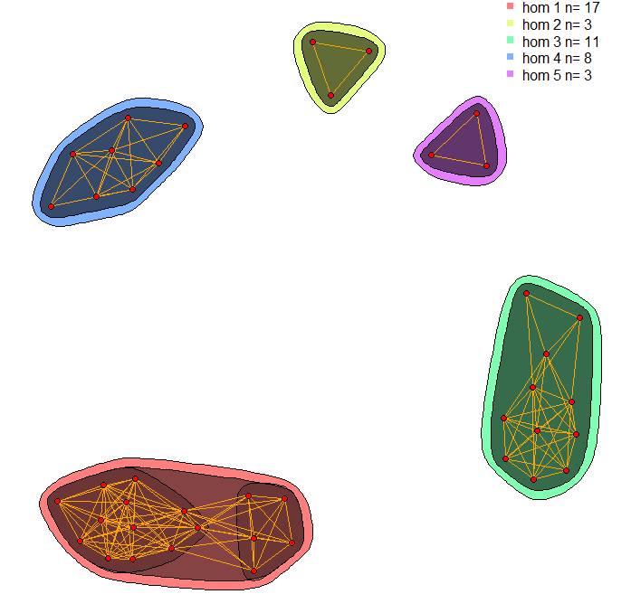

This vignette is additional to the basic `polymapR` vignette "How to use polymapR", to which we would direct readers' attention to [first](https://CRAN.R-project.org/package=polymapR).

Here, we will go through the main steps of polyploid linkage analysis using `polymapR` [@bourke2018polymapr] when discrete dosages are not available or not desired, but where genotype probabilities are instead available. Genotype probabilties are a direct output of many polyploid genotype callers such as `fitPoly` [@Voorrips2011], `updog` [@gerard2018] or `polyRAD` [@clark2019], although dosage probabilities from any other genotyping software can be used. 

For more background information on the functions described here, please refer to the [2021 article](https://link.springer.com/article/10.1007/s00122-021-03834-x) of Liao *et al.* [@liao2021]. 

## Table of Contents
1. [Introduction](#sect1)
2. [Importing sample data](#sect2)
3. [Initial mapping steps](#sect3)
4. [Data filtering](#sect4)
5. [Marker conversion](#sect5)
6. [Linkage analysis](#sect6)
7. [Ordering the map](#sect7)
8. [References](#sect8)


<a name="sect1"></a>

## 1. Introduction

By their very nature, probabilistic datasets in polyploids are larger than discrete ones: each marker-individual combination has *ploidy* + 1 floating-point numbers associated with it, in comparison to a single integer value for a discrete dataset. For example, we might encounter the following probabilistic data for 5 SNP markers in a single tetraploid individual:

|      |       P0|       P1| P2| P3| P4|
|:-----|:-------:|:-------:|:-:|:-:|:-:|
|snp01 | 0.999849| 0.000151|  0|  0|  0|
|snp02 | 0.000238| 0.999762|  0|  0|  0|
|snp03 | 0.000000| 1.000000|  0|  0|  0|
|snp04 | 0.000001| 0.999999|  0|  0|  0|
|snp05 | 0.009729| 0.990271|  0|  0|  0|

Using discrete dosages (*e.g.* by selecting the maximum probability) would give the following table for the same individual:

|      | geno|
|:-----|:---:|
|snp01 |    0|
|snp02 |    1|
|snp03 |    1|
|snp04 |    1|
|snp05 |    1|

However, there are some advantages to probabilistic genotypes - in cases where uncertainty exists in the genotype assignment, it might not be obvious how to discretise the genotype scores. This may lead to observations being marked as missing data or even being entirely removed from the dataset, depending on what filtering thresholds are used. 

Probabilistic genotypes are a standard output from many polyploid genotype calling procedures. This vignette assumes the R package `fitPoly` has been used (developed to score the output of SNP arrays). `polymapR` also includes functions to convert the output of other polyploid genotype callers developed for sequencing reads into a compatible format. For example, output of the `multiflex` function of `updog` can be re-formatted using the `convert_updog` function, while `convert_polyRAD` does the same with the `RADobject` output of function `PipelineMapping2Parents` in R package `polyRAD`.

<a name="sect2"></a>

## 2. Importing sample data
In this vignette we will use a simulated SNP dataset from an autotetraploid F1 population with 200 individuals. This fictive organism has 5 chromosomes (2n = 4x = 10) and exhibits polysomic inheritance (although the pairing behaviour was that of random bivalents). The dataset was generated using `PedigreeSim` [@Voorrips2012] and the `GenoSim` package (Liao, Tumino *et al., in preparation*) which simulates SNP array intensity values (and also sequencing reads) given an underlying population. The genotypes were called using `fitPoly` [@Voorrips2011] using the function `saveMarkerModels`. 


The data should be downloaded from the following FigShare repository and saved to your working directory:   
<br></br>

https://figshare.com/articles/dataset/fitPoly_4x_output_2343_SNPs/12589271  


<a name="sect3"></a>

## 3. Initial mapping steps

We will assume you have already installed or updated the version of `polymapR` to at least version 1.1.0. If not, please install the latest version of `polymapR` from CRAN:

```{r, eval = FALSE}
install.packages("polymapR")
library(polymapR)
```

Assuming you have not altered the filename of the sample dataset, we will first load the genotype data into R:

```{r, eval = FALSE}
geno <- read.csv("fitPoly_4x_output_2343_SNPs.csv")
```
```{r, echo = FALSE}
library(polymapR)
data("gp_vignette_data")
individuals <- gp_vignette_data$individuals
parent1 <- gp_vignette_data$parent1
parent2 <- gp_vignette_data$parent2
geno.sub <- gp_vignette_data$geno.sub
chk1.sub <- gp_vignette_data$chk1.sub
pardose.sub <- gp_vignette_data$pardose.sub
maxP.chk <- gp_vignette_data$maxP.chk
SN_SN_P1.sub <- gp_vignette_data$SN_SN_P1.sub
P1_homologues <- gp_vignette_data$P1_homologues
P2_homologues <- gp_vignette_data$P2_homologues
LGHomDf_P1 <- gp_vignette_data$LGHomDf_P1
LGHomDf_P2 <- gp_vignette_data$LGHomDf_P2 
LGHomDf_P1a <- gp_vignette_data$LGHomDf_P1a
P1_SxS_Assigned <- gp_vignette_data$P1_SxS_Assigned
P2_SxS_Assigned <- gp_vignette_data$P2_SxS_Assigned
```

Have a look at the layout of the data, as this is generally the format that is expected for probabilistic genotypes:

```{r, eval = FALSE}
knitr::kable(head(geno))
```
```{r, echo = FALSE}
knitr::kable(head(geno.sub))
```

For clarity, we'll also define what the parental and offspring samples are already. In this dataset there are two maternal replicates ('P1' and 'P1a') but only a single paternal replicate ('P2'). It is quite common (recommended in fact) to have multiple parental replicates to ensure parental calls are reliable.

```{r, eval = FALSE}
parent1.reps <- c("P1","P1a")
parent2.reps <- "P2"
individuals <- setdiff(unique(geno$SampleName),c(parent1.reps,parent2.reps))
```

The first step in the mapping using probabilistic genotypes is to run the `checkF1` function (written by Roeland Voorrips). This looks for concordance between parental and offspring genotypes, as well as checking for marker skewness / distorted segregation under various genetic models (disomic, polysomic, mixed) and returns a number of different quality parameters that might be useful for flagging problematic markers. See `?checkF1` for more details. We will capture the output of `checkF1`, as this will be needed in many subsequent function calls:

```{r, eval = FALSE}
chk1 <- checkF1(input_type = "probabilistic",
                probgeno_df = geno,
                parent1 = parent1.reps,
                parent2 = parent2.reps,
                F1 = individuals,
                polysomic = TRUE,
                disomic = FALSE,
                mixed = FALSE,
                ploidy = 4)
```

This function returns a list with elements `checked_F1` (the actual function output) and `meta` (which carries the information about parameter settings used). Note that we have assumed that we are dealing with a polysomic species here (`polysomic = TRUE`). In cases where there is uncertainty regarding the mode of inheritance, it can be useful to run `checkF1` multiple times, e.g. setting `polysomic = FALSE` and `disomic = TRUE`. Quality of the markers can be assessed by filtering on `qall_mult` > 0 for example. In some cases, you may notice that parental scores have been made missing:

```{r, eval = FALSE}
chk1$checked_F1[1:5,]
```
```{r, echo = FALSE}
chk1.sub[1:5,]
```

If you are interested, you can impute these values using the internal function `assign_parental_dosage` within `polymapR` as follows:

```{r, eval = FALSE}
pardose <- polymapR:::assign_parental_dosage(chk = chk1,
                                             probgeno_df = geno)
knitr::kable(head(pardose))
```
```{r, echo = FALSE}
knitr::kable(head(pardose.sub))
```

For now, we will just focus our attention on potentially problematic markers that have had a `qall_mult` value of 0:

```{r, eval = FALSE}
length(which(chk1$checked_F1$qall_mult == 0)) #859 markers
```

There appear to be quite a large number of markers with questionable agreement between parental and offspring scores - we will remove these as follows:

```{r, eval = FALSE}
remove.mark <- chk1$checked_F1[chk1$checked_F1$qall_mult==0,"MarkerName"]
geno1 <- geno[!geno$MarkerName %in% remove.mark,]
```
If you are concerned about removing these markers, you can revisit them later on and try to add them back to the map. For now we will proceed with a cleaned-up dataset, as this makes the mapping a lot easier.

<a name="sect4"></a>

## 4. Data filtering
### 4.1. Quality check on offspring scores
We can get an overview of the "precision" of probability scores using the function `gp_overview`:
```{r, eval = FALSE}
gpo <- gp_overview(probgeno_df = geno1)
```
```{r, out.width = "500px", echo = FALSE, fig.align="center"}

```

By default a plot is generated giving some summary statistics of the marker scores, such as the mean genotype probability encountered etc. The output can be used to filter the marker dataset further (although here using the default parameters no filtering actually occurs):

```{r, eval = FALSE}
geno1 <- gpo$probgeno_df
```

### 4.2. Distribution of maximum genotype probabilities
The next step is to have a look at the distribution of maximum genotype probabilities, as we would ideally like these to be as close to 1 as possible in a clearly-scored dataset:

```{r, eval = FALSE}
maxP.chk <- check_maxP(probgeno_df = geno1)
```
```{r, echo = FALSE}
print(maxP.chk)
```
```{r, out.width = "550px", echo = FALSE, fig.align="center"}

```

This may give some indication of possible issues with the assigned genotypes. In the example above, over 90% of the data (marker-individual combinations) had an assigned probability of 0.95 or higher - suggesting a relatively high-quality dataset.


### 4.3. Screen for duplicate individuals
As in the original `polymapR` pipeline, it is also possible to check the marker data for duplicate individuals. This is accomplished using the `screen_for_duplicate_individuals.gp` function: 

```{r, eval = FALSE}
geno2 <- screen_for_duplicate_individuals.gp(probgeno_df = geno1,
                                             ploidy = 4,
                                             parent1 = parent1.reps,
                                             parent2 = parent2.reps,
                                             F1 = individuals)
```
```{r, out.width = "550px", echo = FALSE, fig.align="center"}

```
```{r, echo = FALSE}
write("\nNo duplicates found\n",stdout())
```

### 4.4. Screen for duplicate markers
Currently there is no specific function to check for duplicate markers using genotype probabilities. The current advice here is to discretise the data and use the `screen_for_duplicate_markers` function from the original `polymapR` pipeline, and then go back and filter the probabilistic dataset. Specific functions to assist with this task are planned but not currently implemented.

### 4.5. Screening for missingness
Note that with genotype probabilities there are no missing values, so screening for missing values per marker or per individual is no longer needed or possible. 


<a name="sect5"></a>

## 5. Marker conversion
In the original `polymapR` pipeline, marker conversion is an important step that reduces the number of marker segregation types to a smaller set (without any loss or distortion of the linkage information they contain). This function has been moved to an internal function as part of the `linkage.gp` call and therefore is no longer directly run by the user.

<a name="sect6"></a>

## 6. Linkage analysis
The rest of the mapping pipeline is very similar to that of the original `polymapR` pipeline. We will run quickly through the steps here, starting with estimation of pairwise recombination frequencies using the `linkage.gp` function. Note that there are two possible methods / approaches here. The default method (`method = "approx"`) uses an approximation, by summing the probabilities of each genotype class across the population, and using these as estimates for different marker classes in the two-point estimation of recombination frequency. This has been shown to lead to biased estimates of recombination frequency (thanks to Marcelo Mollinari, NCSU for highlighting this), but has the advantage that (a) the calculation is much faster and (b) the bias is in general rather small and can probably be ignored. The full likelihood, in which all dosage probabilities are carried through in the calculation, has been implemented in the `mappoly` function `est_pairwise_rf`, the results of which can also be used in `polymapR`. Therefore, although there can be quite a computational penalty involved here, the results using `method = "mappoly"` are of higher accuracy.

The function, like a number of others in `polymapR` allows for parallel processing using the argument `ncores`. To detect how many available cores your computer has, as well as determining a reasonable number of them to use (max - 2 for example) we first run the following:

```{r}
nc <- parallel::detectCores() - 2
```

Note that because we have filtered the marker dataset, we need to re-run `checkF1` at this point to have a compatible genotype and checkF1 object:

```{r, eval = FALSE}
chk1 <- checkF1(input_type = "probabilistic",
                probgeno_df = geno2,
                parent1 = parent1.reps,
                parent2 = parent2.reps,
                F1 = individuals,
                polysomic = TRUE,
                disomic = FALSE,
                mixed = FALSE,
                ploidy = 4)
```

In what follows, we are using the approximate method for recombination frequency estimation. If the full likelihood approach is required, make sure to specify `method = "mappoly` in the calls to the `linkage.gp` function.


### 6.1 Simplex markers - clustering homologues
We begin with the simplex markers in parent 1 in order to begin with marker clustering:

```{r, eval = FALSE}
SN_SN_P1 <- linkage.gp(probgeno_df = geno2,
                       chk = chk1,
                       markertype1 = c(1,0),
                       target_parent = "P1",
                       LOD_threshold = 3,
                       ncores = nc)
```

The output of this function is a linkage data.frame, with the following format:

```{r, eval = FALSE}
head(SN_SN_P1)
```
```{r, echo = FALSE}
head(SN_SN_P1.sub)
```

We can immediately begin to cluster this data into homologues using the `cluster_SN_markers` function as follows (after first setting `par(mfrow)` to 2 rows and 1 column to keep the 2 output plots together):

```{r, eval = FALSE}
par(mfrow = c(2,1))
P1_homologues <- cluster_SN_markers(linkage_df = SN_SN_P1,
                                    LOD_sequence = seq(3,12,0.5),
                                    LG_number = 5,
                                    ploidy = 4,
                                    parentname = "P1",
                                    plot_clust_size = FALSE,
                                    min_clust_size = 3)
```
```{r, out.width = "600px", echo = FALSE, fig.align="center"}

```

Here, we specify that we expect there to be 5 chromosomal linkage groups (`LG_number = 5`) and we look at the clustering over a range of LOD values (from 3 to 12 in steps of 0.5). We also demand that the `min_clust_size` is 3, so we are not interested in clusters with fewer than 3 markers (you can choose this value yourself). Had we set `plot_clust_size` to be `TRUE`, we would see instead the number of markers per cluster rather than a visualisation of their size with a red dot.

Although we are looking for 20 clusters here (an auto-tetraploid with 5 chromosomes, so 5 x 4 = 20 homologue clusters are expected per parent), we can immediately see that there is a clear splitting of the data into 5 chromosomes at a lower LOD scores (as well as some "noise" - small clusters of markers that are separate from the rest and will be / should be discarded). It is less simple to see at which LOD score the homologues split apart (in fact, there are variable LOD scores that are relevant). If we look at the upper plot we see that there is a sort of plateau in the data (black solid line) between LOD 5 - 8 approx, and so we could take some LOD value in this range. It is useful to have a look at the breakdown of cluster size in more detail:

```{r}
sort(table(P1_homologues[['7']]$cluster),decreasing = T)
length(table(P1_homologues[['7']]$cluster)) 
```

So there are 21 clusters at LOD 7 (we wanted 20, this is close enough) and there seems to be a good distribution of markers across these clusters (at most 17 markers and at least 3, but all with more or less the same order of magnitude in terms of size). We'll go with this for now, and switch our attention to parent 2 in the same way:

```{r, eval = FALSE}
SN_SN_P2 <- linkage.gp(probgeno_df = geno2,
                       chk = chk1,
                       markertype1 = c(1,0),
                       target_parent = "P2",
                       LOD_threshold = 3,
                       ncores = nc)
```

We cluster the parent 2 data as before:

```{r, eval = FALSE}
P2_homologues <- cluster_SN_markers(linkage_df = SN_SN_P2,
                                    LOD_sequence = seq(3,12,0.5),
                                    LG_number = 5,
                                    ploidy = 4,
                                    parentname = "P2",
                                    plot_clust_size = F,
                                    min_clust_size = 3)
```
```{r, out.width = "600px", echo = FALSE, fig.align="center"}

```

Here the plateau in the upper plot is less obvious, but it is possible to see the chromosomal linkage groups splitting up nicely into homologue clusters in the lower plot. At LOD 4.5 we seem to have identified our chromosomes already. If we follow these we can see that around LOD 6 we have identified for the most part 4 homologues (this would have been better at LOD 5 for the first chromosome - we are working in this direction but the function doesn't handle it yet). For the moment, we will use a LOD of 6:
```{r}
sort(table(P2_homologues[['6']]$cluster),decreasing = T)
length(table(P2_homologues[['6']]$cluster)) 
```

Here we see there are 22 clusters - again close enough to what we want.

### 6.2 Higher-dose markers - connecting clustered homologues
In this dataset it would have been possible to define chromosomal linkage groups from the 1x0 data alone - see the main vignette for how to proceed if this is the case in your data also (using the function `define_LG_structure`). However, for now we will assume things are not so straightforward. We next turn to the simplex x simplex markers (1x1) which can help provide bridging links between homologues to assist in the clustering puzzle (duplex markers can also be used, see the main vignette for more details here). We first calculate the linkage between 1x0 and 1x1 markers, and then use this information for joining our homologue clusters together into chromosomal linkage groups.

```{r, eval = FALSE}
SN_SS_P1 <- linkage.gp(probgeno_df = geno2,
                       chk = chk1,
                       markertype1 = c(1,0),
                       markertype2 = c(1,1),
                       target_parent = "P1",
                       ncores = nc)

SN_SS_P2 <- linkage.gp(probgeno_df = geno2,
                       chk = chk1,
                       markertype1 = c(1,0),
                       markertype2 = c(1,1),
                       target_parent = "P2",
                       ncores = nc)
```

Using the function `bridgeHomologues` we can now look for associations between the homologue clusters, first in parent 1:
```{r, eval = FALSE}
LGHomDf_P1 <- bridgeHomologues(cluster_stack = P1_homologues[["7"]],
                               cluster_stack2 = P2_homologues[["7"]],
                               linkage_df = SN_SS_P1,
                               linkage_df2 = SN_SS_P2,
                               LOD_threshold = 5,
                               LG_number = 5)
```
```{r, out.width = "450px", echo = FALSE, fig.align="center"}

```

One of the chromosomes has too many homologues while another one has only 3. We can see this more clearly using the `table` function:
```{r}
table(LGHomDf_P1$LG,LGHomDf_P1$homologue)
```
However, we do have a clear clustering into 5 linkage groups, the number of chromosomes we expected in this species. 

We can perform a similar step in parent 2, however this time at LOD 6:
```{r, eval = FALSE}
LGHomDf_P2 <- bridgeHomologues(cluster_stack = P2_homologues[["6"]],
                               cluster_stack2 = P1_homologues[["6"]],
                               linkage_df = SN_SS_P2,
                               linkage_df2 = SN_SS_P1,
                               LOD_threshold = 5,
                               LG_number = 5)
```
```{r, out.width = "450px", echo = FALSE, fig.align="center"}

```
Again have a look more closely:
```{r}
table(LGHomDf_P2$LG,LGHomDf_P2$homologue)
```

So again we are missing one homologue, but for the rest it seems quite OK.

We have a number of options to merge homologues (or just delete the small ones) - as it is not possible to proceed in a tetraploid mapping with more than 4 homologues per parent. In this example dataset we'll use the function `cluster_per_LG`:

```{r, eval = FALSE}
LGHomDf_P1a <-cluster_per_LG(LG = 3,
                             linkage_df = SN_SN_P1[SN_SN_P1$phase == "coupling",], 
                             LG_hom_stack = LGHomDf_P1, 
                             LOD_sequence = 3:10, 
                             modify_LG_hom_stack = TRUE, 
                             network.layout = "stacked",
                             nclust_out = 4,
                             label.offset=1.2) 
```
```{r, out.width = "450px", echo = FALSE, fig.align="center"}

```

In this example, it is not possible to merge homologues satisfactorily using this function (even if we go down to LOD = 0). Since we have specified that there should be at most 4 clusters in the output (`nclust_out = 4`) and that we want to modify the LG_hom_stack object (`modify_LG_hom_stack = TRUE`), the function does the only thing it can in this situation - delete the smallest homologue (here, it is a random decision as there were two small homologues with only 3 markers)...

```{r}
table(LGHomDf_P1a$LG,LGHomDf_P1a$homologue)
```

In parent 2 we don't have to do any merging as we had no situation of more than 4 homologues. 

### 6.3 Marker assignments
Now that we have a structure with simplex markers that define both a LG and a homologue, we are in a position to start assigning other marker types - if you are unclear about what we just did, have a look at one of the LGHomDf stacks, *e.g.*:

```{r}
head(LGHomDf_P1a)
```

This is not quite a marker assignment object, but it is getting close. We have already calculated linkage with 1x1 markers, so these can be assigned directly as follows:

```{r, eval = FALSE}
P1_SxS_Assigned <- assign_linkage_group(linkage_df = SN_SS_P1,
                                        LG_hom_stack = LGHomDf_P1a,
                                        SN_colname = "marker_a",
                                        unassigned_marker_name = "marker_b",
                                        phase_considered = "coupling",
                                        LG_number = 5,
                                        LOD_threshold = 3,
                                        ploidy = 4)

P2_SxS_Assigned <- assign_linkage_group(linkage_df = SN_SS_P2,
                                        LG_hom_stack = LGHomDf_P2,
                                        SN_colname = "marker_a",
                                        unassigned_marker_name = "marker_b",
                                        phase_considered = "coupling",
                                        LG_number = 5,
                                        LOD_threshold = 3,
                                        ploidy = 4)
```

We can now directly compare the assignments in both parents to get a "consensus" naming of the chromosomal linkage groups across parents:

```{r}
LGHomDf_P2c <- consensus_LG_names(modify_LG = LGHomDf_P2, 
                                  template_SxS = P1_SxS_Assigned, 
                                  modify_SxS = P2_SxS_Assigned)
```

Overall, looking at the diagonal in the lower table (these are the number of 1x1 markers that have been assigned to this linkage group in both parents), it is clear which linkage groups correspond across parents. 

It is a good idea to save these objects (*e.g.* using `save` or `saveRDS`):

```{r, eval = FALSE}
save(LGHomDf_P1a,LGHomDf_P2c, file = "LGHomDf_stacks.Rdata") #for example.. 
```

We re-run the P2 assignment for the 1x1 markers, now that our naming of linkage groups has changed in this parent:

```{r, eval = FALSE}
P2_SxS_Assigned <- assign_linkage_group(linkage_df = SN_SS_P2,
                                        LG_hom_stack = LGHomDf_P2c, #this is changed
                                        SN_colname = "marker_a",
                                        unassigned_marker_name = "marker_b",
                                        phase_considered = "coupling",
                                        LG_number = 5,
                                        LOD_threshold = 3,
                                        ploidy = 4)
```

We now run the complete marker assignment for both parents and the rest of the markers, using linkage with our 1x0 markers:

```{r, eval = FALSE}
marker_assignments_P1 <- homologue_lg_assignment(input_type = "probabilistic",
                                                 probgeno_df = geno2,
                                                 chk = chk1,
                                                 assigned_list = list(P1_SxS_Assigned),
                                                 assigned_markertypes = list(c(1,1)),
                                                 LG_hom_stack = LGHomDf_P1a,
                                                 target_parent = "P1",
                                                 other_parent = "P2",
                                                 ploidy = 4,
                                                 pairing = "random",
                                                 convert_palindrome_markers = FALSE,
                                                 LG_number = 5,
                                                 LOD_threshold = 3,
                                                 write_intermediate_files = FALSE)

marker_assignments_P2 <- homologue_lg_assignment(input_type = "probabilistic",
                                                 probgeno_df = geno2,
                                                 chk = chk1,
                                                 assigned_list = list(P2_SxS_Assigned),
                                                 assigned_markertypes = list(c(1,1)),
                                                 LG_hom_stack = LGHomDf_P2c,
                                                 target_parent = "P2",
                                                 other_parent = "P1",
                                                 ploidy = 4,
                                                 pairing = "random",
                                                 convert_palindrome_markers = FALSE,
                                                 LG_number = 5,
                                                 LOD_threshold = 3,
                                                 write_intermediate_files = FALSE)
```

Once this step has completed (it takes a couple of minutes) we can compare chromosomal linkage group assignments for all markers across parents and screen out those markers that give conflicting results, a further quality check:

```{r, eval = FALSE}
marker_assignments <- check_marker_assignment(marker_assignments_P1,marker_assignments_P2)
```

This is a very important object and it is recommended to save this also (rather than relying on it being saved in a heap in the Global Environment, which is a somewhat sloppy practice):

```{r, eval = FALSE}
saveRDS(marker_assignments, file = "marker_assignments.RDS")
```

The final step in the linkage analysis is to compile linkage estimates for *all* pairs of markers within a chromosomal linkage group using the `finish_linkage_analysis` function. This step may take a bit longer, so this is a good time to catch up on some other work, having set both of the following function calls running:

```{r, eval = FALSE}
all_linkages_list_P1 <- finish_linkage_analysis(input_type = "probabilistic",
                                                marker_assignment = marker_assignments$P1,
                                                probgeno_df = geno2,
                                                chk = chk1,
                                                target_parent = "P1",
                                                other_parent = "P2",
                                                convert_palindrome_markers = FALSE,
                                                ploidy = 4,
                                                pairing = "random",
                                                LG_number = 5, 
                                                ncores = nc) 

all_linkages_list_P2 <- finish_linkage_analysis(input_type = "probabilistic",
                                                marker_assignment = marker_assignments$P2,
                                                probgeno_df = geno2,
                                                chk = chk1,
                                                target_parent = "P2",
                                                other_parent = "P1",
                                                convert_palindrome_markers = TRUE,
                                                ploidy = 4,
                                                pairing = "random",
                                                LG_number = 5,
                                                ncores = nc) 
```

We compile the results from both parents into a single list as follows:

```{r, eval = FALSE}
linkages <- list()
for(lg in names(all_linkages_list_P1)){
  linkages[[lg]] <- rbind(all_linkages_list_P1[[lg]], all_linkages_list_P2[[lg]])
}
```

This (large) object is also worth saving. We will again use the `.RDS` format:

```{r, eval = FALSE}
saveRDS(linkages, file = "linkages.RDS")
```

This can be read back in using `readRDS` in future:

```{r, eval = FALSE}
linkages <- readRDS("linkages.RDS")
```


<a name="sect7"></a>

## 7. Ordering the map
For map ordering we use the ordering algorithm implemented in the `MDSMap` package [@Hackett2016]. This is achieved using the function `MDSMap_from_list`:

```{r, eval = FALSE}
integrated.maplist <- MDSMap_from_list(linkages)
```

Once the map has been generated, we can use the marker assignment information to generate a phased linkage map (necessary for other subsequent steps *e.g.* IBD-based QTL mapping, available in the `polyqtlR` package):

```{r, eval = FALSE}
phased.maplist <- create_phased_maplist(input_type = "probabilistic",
                                        maplist = integrated.maplist,
                                        chk = chk1,
                                        ploidy = 4,
                                        marker_assignment.1 = marker_assignments$P1, 
                                        marker_assignment.2 = marker_assignments$P2)
```

For extra details *e.g* on map visualisations, see the [main](https://CRAN.R-project.org/package=polymapR) `polymapR` vignette.

<a name="sect8"></a>

## 8. References
